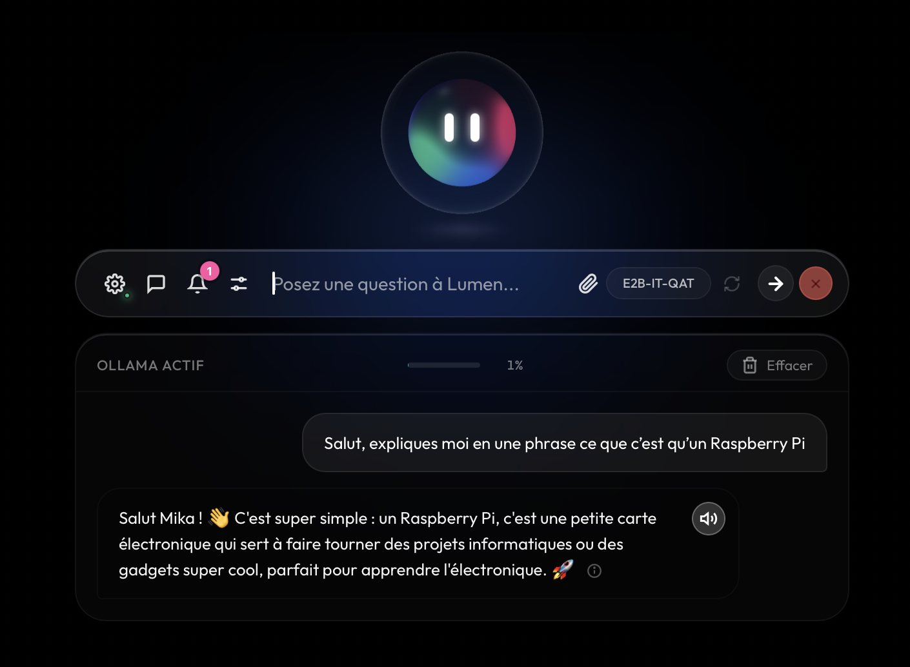
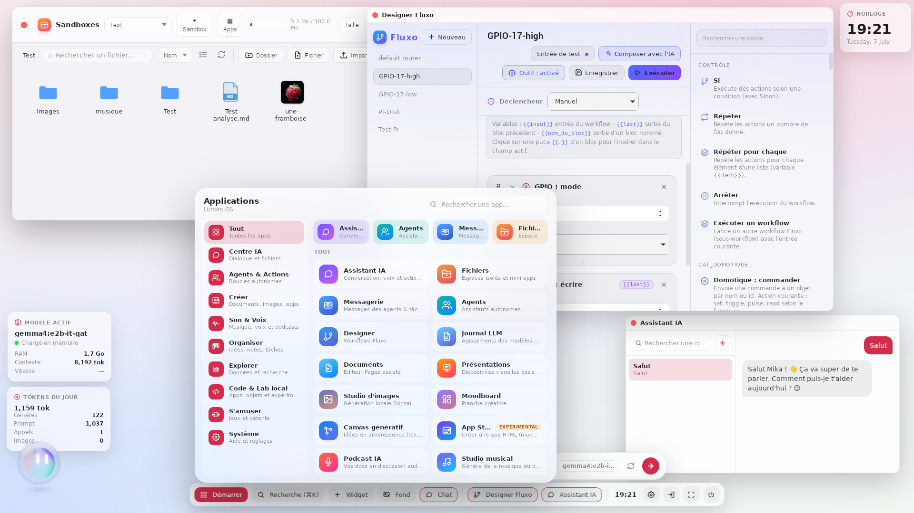

# Lumen

  

  
  
  
  

**Un assistant IA de bureau local-first — une barre de chat vivante, privée et agentique, qui grandit jusqu'à devenir un bureau complet.**

Lumen tourne en local via [Ollama](https://ollama.com) (le modèle, l'inférence et les données restent sur votre machine), peut utiliser les modèles d'Apple, ou se connecter à une API compatible OpenAI quand un modèle cloud est plus adapté.

➡️ **[Télécharger la dernière version](https://github.com/Oneil974/lumen-app/releases/latest)** · 🌐 **[Site de présentation](https://Oneil974.github.io/lumen-app/)**

---

## ✨ Une barre vivante

Une capsule de chat flottante, toujours à portée de main, avec un **orbe animé** qui respire, écoute et réagit.

- **Orbe vivant** — état, humeur et couleurs personnalisables ; il pulse quand Lumen réfléchit ou agit.
- **Trois backends** — Ollama local, modèles Apple, ou API cloud compatible OpenAI ; on change de source en un clic.
- **Plusieurs modes** — chat direct, routeur d'action, tool calling (l'IA déclenche de vraies actions système).
- **Voix & dictée** — synthèse vocale (système, Piper, Kokoro) et dictée whisper.cpp, y compris 100 % hors-ligne.
- **Profil & mémoire** — Lumen sait qui vous êtes, retient ce qui compte et s'en sert dans ses réponses.
- **App compagnon** — miroir de la session sur votre téléphone, via le réseau local.

## 🖥️ Lumen OS — le bureau immersif

Un environnement de travail complet dans une fenêtre : session multi-profils avec mot de passe, fenêtres, widgets, Spotlight (⌘K), centre de notifications, thèmes clair/sombre.

  
   
  <em>Lumen OS tournant sur un Raspberry Pi : launcher, Designer Fluxo (blocs GPIO) et Assistant IA en local.</em>

- **Sandbox IA** — des espaces fichiers isolés et confinés où les agents peuvent lire, écrire et exécuter sans toucher au reste de la machine.
- **Mémoire cognitive** — 8 types de souvenirs, politique d'accès cloisonnée, application dédiée pour explorer et corriger ce que Lumen retient.
- **Connaissances (RAG)** — indexez vos documents et interrogez-les en langage naturel.
- **Bases de données** — tables SQLite façon Baserow, requêtes en langage naturel (lecture seule), intégrées aux autres apps.
- **Mini-apps & App Studio** — créez vos propres apps de bureau, l'IA vous aide à les coder.

## 🤖 Agents, Fluxo & Skills

- **Agents autonomes** — des assistants qui traitent vos tâches en arrière-plan, avec garde-fous (tokens, itérations, escalade).
- **Designer Fluxo** — éditeur visuel de workflows en glisser-déposer : déclencheurs, actions système, blocs IA, notifications.
- **Skills** — les agents créent et versionnent leurs propres compétences réutilisables.
- **Messagerie** — les agents rendent compte dans une inbox ; répondez pour créer une nouvelle tâche.
- **Atelier & Journal LLM** — observez vos agents travailler en direct et auditez chaque appel au modèle.

## 🎨 Plus de 30 apps intégrées

**Créer** (studio d'images local, éditeur de code, canvas génératif, moodboard, mindmap) · **Son & Voix** (podcast IA, studio musical génératif, labo de voix) · **Organiser** (kanban, calendrier, notes, tables) · **Explorer** (recherche, data analysis avec dashboards, atelier ML) · **Code & Lab** · **S'amuser** (jeux contre l'IA, compagnon virtuel, village).

## 🍓 Lumen Pi

Un build dédié Raspberry Pi : blocs Fluxo **GPIO** (pigpiod) pour piloter du matériel, voix locales Piper/Kokoro, barre flottante et mode plein écran — un assistant vocal et domotique 100 % local sur un Pi.

## Télécharger

➡️ **[Dernière version — page de téléchargement](https://github.com/Oneil974/lumen-app/releases/latest)**

| Plateforme | Fichier |
|---|---|
| macOS (Apple Silicon) | `.dmg` |
| Windows | `.exe` (installeur) |
| Linux (Debian/Ubuntu) | `.deb` |
| Raspberry Pi (arm64) | `.deb` |

## Prérequis & installation

Pour l'inférence 100 % locale, Lumen a besoin d'**[Ollama](https://ollama.com)**. Des scripts « tout-en-un » installent Ollama + un modèle, et (sous Linux/Pi) les voix locales **Piper** & **Kokoro** et la dictée **whisper.cpp** :

| Système | Commande (dans `scripts/`) |
|---|---|
| macOS | `./setup-macos.sh` |
| Linux (Debian/Ubuntu) | `./setup-linux.sh` |
| Raspberry Pi OS | `./setup-pi.sh` |
| Windows | `powershell -ExecutionPolicy Bypass -File .\setup-windows.ps1` |

Détails, options et installation séparée des voix : **[scripts/README.md](scripts/README.md)**.

## Confidentialité

En mode local (Ollama), **aucune donnée ne quitte votre machine** : modèle, inférence, mémoire, documents et bases restent sur votre disque. Le mode API cloud est optionnel et entièrement désactivable.

Ce dépôt héberge la page de présentation et les binaires de l'application (via *Releases*). Le code source n'est pas publié ici.
